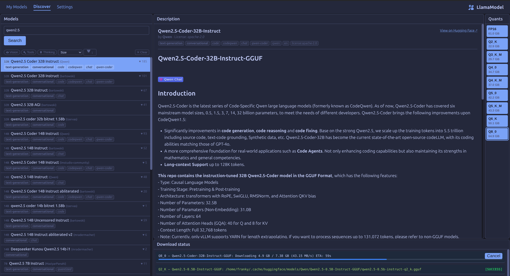
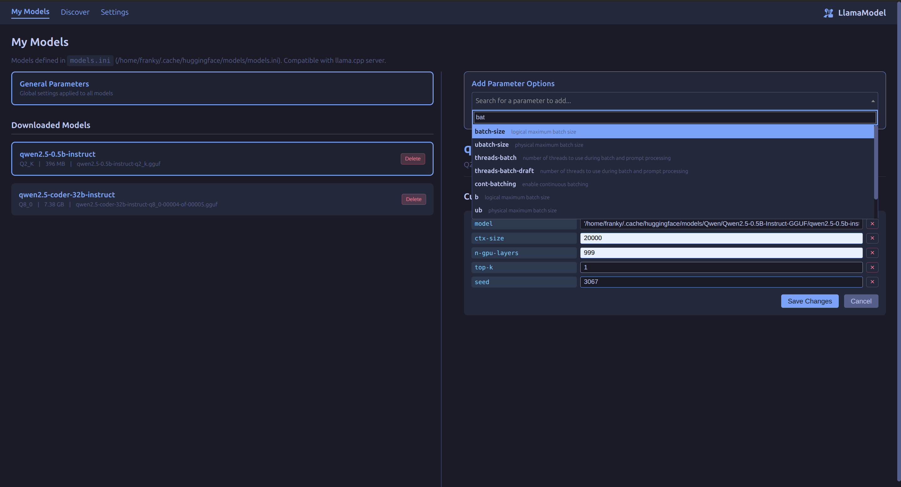
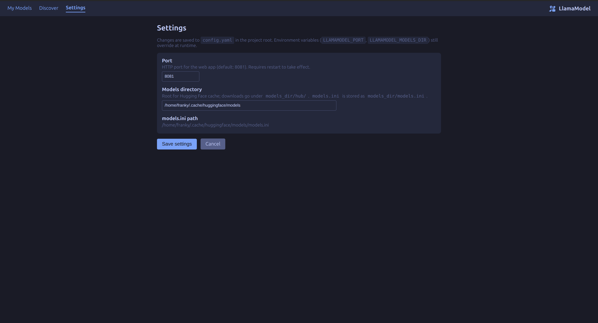

# LlamaModel

A Python web application to manage large language models for **llama.cpp** servers: search and browse GGUF models on Hugging Face, download selected quantizations, and maintain a `models.ini` file compatible with the llama.cpp server.

**Note:** This application is currently in its **alpha phase** and has only been tested on **Linux**.

## Screenshots

### Discover


### My Models


### Settings


## Features

- **Discover** – Search Hugging Face for GGUF-compatible models (LMStudio-like interface). Filter by tags or text.
- **Model Detail** – View the Hugging Face model card, introduction, and a list of available quantizations (GGUF files), along with download sizes.
- **Download Management** – Download a chosen quantization directly via the Hugging Face API into your configured models directory. Active downloads include real-time progress bars, speed metrics, ETA estimates, and a cancel button.
- **models.ini Integration** – After each download, the app intelligently parses the model card for recommended parameters, dynamically structuring an entry in `models.ini`, precisely mapping to the downloaded file.
- **My Models / Parameters Editor** – Configure and edit default loading constraints for models (e.g., context size, GPU layers, seed) using an intuitive interface. Fully compatible with `llama.cpp`'s new configuration file requirements.
- **Configurable Settings** – Web application port and default Hugging Face models directory can be configured through a unified settings view or `config.yaml`.

## Requirements

- Python 3.10+
- Linux (Only tested on Linux)
- Dependencies in `requirements.txt`

## Installation

```bash
git clone https://github.com/your-username/llamamodel.git
cd /path/to/llamamodel
python -m venv venv
source venv/bin/activate
pip install -r requirements.txt
```

## Configuration

| Parameter           | Default                    | Description |
|--------------------|----------------------------|-------------|
| **port**           | `8081`                     | HTTP port for the web app. |
| **models_dir**     | `~/.cache/huggingface/models` | Base directory for Hugging Face downloads. Downloads are saved as `author/model/file`. `models.ini` is stored as `models_dir/models.ini`. |

Configure via:

1. **Web UI:** Navigate to the "Settings" tab in the application.
2. **config.yaml** in the project root:

   ```yaml
   port: 8081
   models_dir: ~/.cache/huggingface/models
   ```

3. **Environment variables** (override config file):

   - `LLAMAMODEL_PORT` – port number
   - `LLAMAMODEL_MODELS_DIR` – path to models directory

## Running

```bash
python run.py
```

Or with uvicorn directly:

```bash
uvicorn app.main:app --host 0.0.0.0 --port 8081
```

Then open **http://localhost:8081** (or the port you configured) in your browser.

## How to Use

1. **Launch the App:** Run the application using the commands above and open the UI in your browser.
2. **Find Models:** Go to the **Discover** page to search for GGUF models. Filter your search by utilizing available tags.
3. **Select and Download:** Click on a model to open its details. In the right panel, you'll see a list of available quantizations alongside file sizes. Click on the quantization to initiate the download.
4. **Monitor Progress:** Keep track of the real-time download bar tracking speed, size, and ETA directly on the Discover page. You can cancel downloads midway if necessary.
5. **Manage Parameters:** Once downloaded, navigate to the **My Models** page. Here, you can configure the parameters `llama.cpp` will use upon initializing the model, such as `n-gpu-layers` and `ctx-size`. Changes are actively saved to `models.ini`.
6. **Start llama.cpp Server:** Serve your chosen model utilizing the newly formatted `models.ini` file:
   ```bash
   llama-server --model-config ~/.cache/huggingface/models/models.ini
   ```

## License

This project is licensed under the **GPL-2.0 License**. See the [LICENSE.md](LICENSE.md) file for details.
